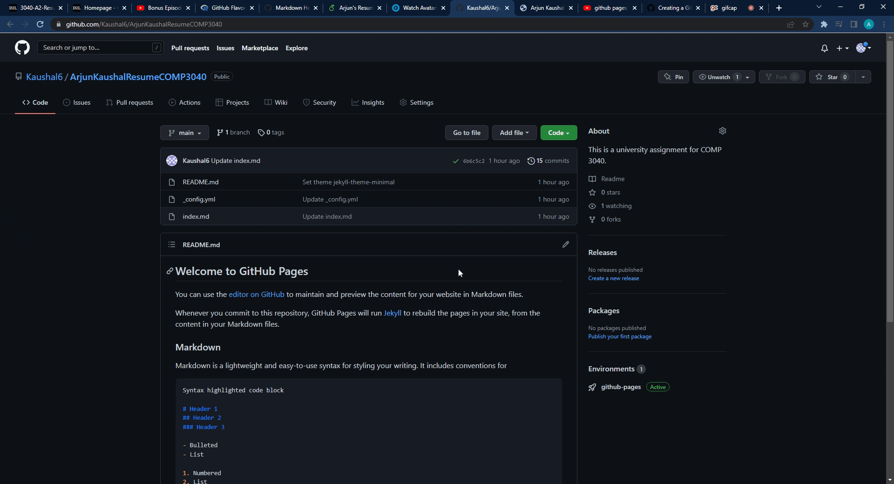

# Arjun Kaushal COMP 3040 Assignment 2

### The purpose of this README file is to describe the practical steps I took to host and format a resume using the software stack that I used. The software stack used for this assignment consisted of the following: Markdown (Github Flavored Markdown), VSCode Markdown Extension, Github Pages, and Jekyll. The purpose is also to relate these steps taken back to Andrew Etters' *Modern Technical Writing*
you used for this assignment.

# Prerequisites
These are some things you should have before following the steps described in this document: 
* A completed resume formatted in Markdown
* Knowledge of basic (Github flavoured) Markdown syntax
* A Github account
* A Markdown editor

# Instructions

## **1: Start a New Repository (Optional)**

### The first thing we need is a repository to host our page. This step is optional because you may choose to use a repository that already exists. Sign in to your Github account and give it a name. Make sure you set your repository visibility as you need it.

## **2: Create and/or Add an .md File to the Repository.**

### This will be the content that is displayed on your website. In our case, the Markdown-formatted resume. 

### **2.1: Use formatting to draw attention and direct the reader**
#### In Andrew Etters' Book, *Modern Technical Writing*, Etter says that using  headers, tables, lists, diagrams, make your writing more approachable and simpler to scan. So make good use of different Markdown heading sizes in your resume to improve your resume's readability.

### **2.2: Add your Markdown-formatted Resume .md file to the repository**
 
#### On the main page of your repository, click 'Add file' and then select 'Upload files' to find your resume .md file. 

### **2.3: Use a lightweight markup**
#### Andrew Etter's recommends us to use only lightweight markup, so that even unrendered files are human-readable and simple to scan through. This is why we choose to use Markdown to render our Resume for this task.

## **3: Adjust your Github Pages Settings**
#### In your repository of choice, click "Settings". 

### **3.1: Select the Source for Pages**
#### In the left-side navigation bar, under "Code and Automation", click 'Pages'. From here, you can choose your "Source" branch to be 'main' so that the .md files are taken from the correct space.

### **3.2: Host Your Page**
#### Save your change to the source and you will get your url. This url is where your .md file will be rendered. For the first time, click the link to view your Markdown-formatted Resume.

### **3.2: Choose a Jekyll Theme to Publish Your Page With**
#### Click 'Change Theme' and browse from the many selections available for your page Theme. Once you have selected a theme, click "Select Theme" to apply the change to your rendered Resume. Wait a few minutes for the change to display and view your Markdown-formatted resume with the newly applied Jekyll theme.

## More Resources:
* #### Andrew Etters' *[*Modern Technical Writing*](https://www.amazon.ca/Modern-Technical-Writing-Introduction-Documentation-ebook/dp/B01A2QL9SS)*
* #### *[A Useful Markdown Syntax Guide](https://www.markdownguide.org/basic-syntax/#urls-and-email-addresses)*
* #### *[A Guide to Github Pages and Jekyll](https://docs.github.com/en/pages/setting-up-a-github-pages-site-with-jekyll/creating-a-github-pages-site-with-jekyll)*

# Authors and Acknowledgements

### Credit and Acknowledgements go to:
*  Github user *[@orderedlist](https://github.com/orderedlist)* - for theJekyll theme used for my assignment submission.
*  My peer editing group mates: Winsom Lam, Braden Jonsson, Anas Ashfaq Mehar, and Joshua Dueck 

# FAQ

### **When does my page first go live?**
#### Your page initially gets hosted after you have adjusted the 'source' field on the 'Pages" settings in your repository settings. Once this is option is selected and saved, you receive the url required to access your hosted and rendered page.

### **Why does my README file already have text in it?**
#### Your repository may initially include a README file with text already in it. This is because when you initially created your Github repository, you selected the option to include a README file in the new repository. You can overwrite the README as needed.

